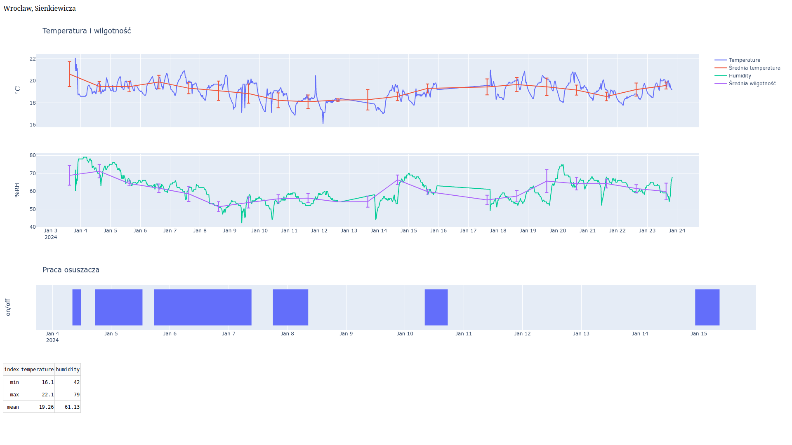
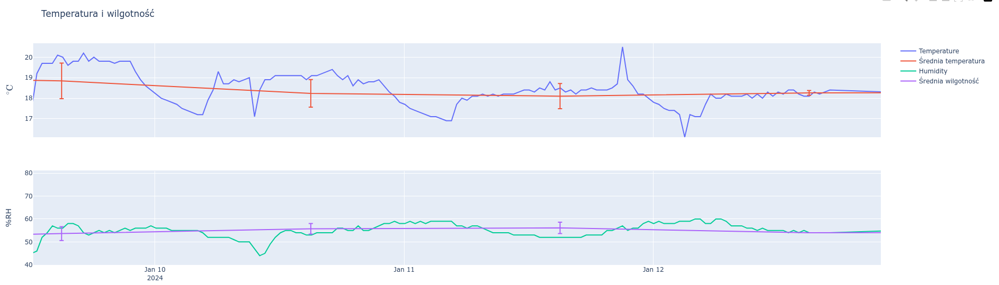

# Roomalyzer - analiza warunków w pomieszczeniach mieszkalnych

Projekt powstał jako próba pomocy w zmniejszaniu rachunków za ogrzewanie oraz zapobieganiu pleśni w mieszkaniu. Grzyb to problem szczególnie istotny w przypadku wiekowych kamienic, które często nie posiadają odpowiedniej wentylacji oraz bywają zaniedbane. Wysoka wilgotność zwiększa szansę na rozrost pleśni, obniża odczuwalną temperaturę, co wpływa na komfort życia i może skutkować częstszymi infekcjami dróg oddechowych. Celem jest zbudowanie estetycznego systemu do wizualizowania zmian temperatury oraz wilgotności w czasie, co pozwoli na wczesne wdrożenie odpowiednich działań. Obserwacja pomiarów pozwoli także na weryfikację, czy podjęte prace, takie jak doszczelnienie okien czy ich wymiana, istotnie wpływają na warunki panujące w pomieszczeniu.

## Wymagania

Aplikacja napisana w ramach projektu powinna spełniać poniższe wymagania:

- Estetyczna wizualizacja zmienności pomiarów w czasie
- Analiza pomiarów temperatury i wilgotności - obliczanie podstawowych wskaźników
- Możliwość wybierania konkretnych zakresów dat
- Forma wizualizacji pozwalająca na zbudowanie panelu kontrolnego
- Wizualizacja czasu pracy osuszacza elektrycznego (w celu weryfikacji skuteczności działania)

Projekt powinien zawierać klasę obsługującą pobieranie oraz przetwarzanie danych. Budowa UI może pozostać w głównym pliku `main.py`. Dodatkowo, użytkownik powinen móc dokonać konfiguracji z użyciem pliku tekstowego, w formacie takim jak `.ini`, `.json` czy `.toml`.

Panel kontrolny powinien wyświetlać się jako niezależne okno graficzne lub w przeglądarce internetowej (wówczas aplikacja pełni rolę serwera).

## Szczegóły techniczne

Projekt napisano w języku Python, wersja 3.11.6. Aplikacja działa we frameworku [Dash](https://dash.plotly.com/), który jest zintegrowany z biblioteką do wizualizacji [Plotly](https://plotly.com/python/) w wersji dla języka Python. Wizualizacja wyświetla się na lokalnym serwerze, tzw. _localhost_, na porcie (domyślnie) `8050`. Do przetwarzania danych służy [Pandas](https://pandas.pydata.org/).
Komentarze w kodzie napisano w języku angielskim, jako że jest to powszechnie przyjęta konwencja. Formatowanie kodu wykonano programem [Black](https://github.com/psf/black). Interpreter ma utworzone środowisko wirtualne.

`Roomalyzer` współpracuje z serwerem [ThingSpeak](https://thingspeak.com/). gdzie przechowywane są dane pochodzące z pomiarów. Źródłem danych może być dowolne urzadzenie IoT pozwalające na komunikację z API ThingSpeak. Zbudowano je z wykorzystaniem prostych żądań HTTP, co zapewnia szerokie możliwości wyboru platformy sprzętowej. W przypadku Autora niniejszego projektu, zastosowano płytkę Arduino Uno WiFi Rev 2 oraz cyfrowy czujnik temperatury i wilgotności DHT11. Pomiar wykonywany jest co 30 minut.

Interaktywne okna pozwalają przybliżyć interesujący fragment wykresu:

